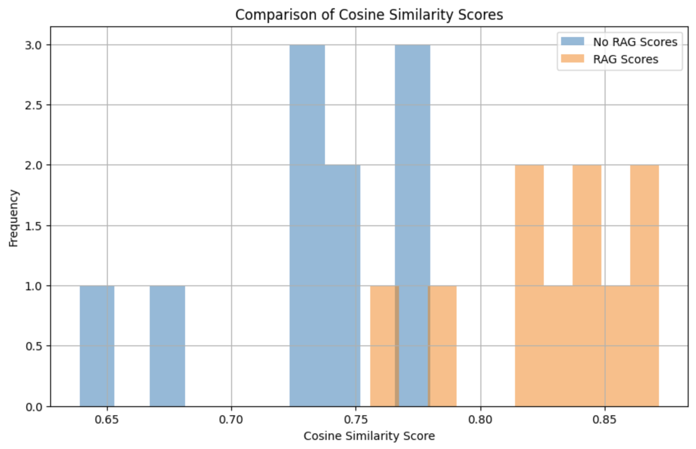

# Daniel's Life: RAG-Powered Image Query Application

This application showcases an innovative approach to visualizing Daniel's life through images, combining advanced NLP and image processing techniques. Users can explore images related to Daniel's experiences by inputting descriptive queries. The application utilizes OpenAI's GPT-4 Vision model, BERT embeddings for semantic search, and MongoDB for data storage, offering a unique glimpse into Daniel's memorable moments.

## Implementation Overview

**Objective:** Build a natural language-based image-retrieval and caption generation web application using Retrieval Augmented Search (RAG).

### Extracting and Processing Data Pipeline

1. **Extract Text Data**: Selected images were imported from Daniel's local computer using the `extract_data.ipynb` notebook.
2. **Generate Descriptions**: The `generate_descriptions.ipynb` script utilizes OpenAI's 'gpt-4-vision-preview' model to generate comprehensive descriptions for each image, eliminating the need for data chunking.
3. **Database Storage**: MongoDB is employed to store image data efficiently. The 'photo-embeddings' collection holds the filename and corresponding embedding, while 'photo-descriptions' stores filenames alongside their descriptions. Additionally, images are securely stored in an AWS S3 bucket.

### Backend Logic

1. **Process User Query:** Upon receiving a user query, convert it into a vector embedding using a BERT model. This prepares the query for similarity comparison with stored image description embeddings.
2. **Retrieve Relevant Descriptions:** Perform a cosine similarity search between the query embedding and the embeddings of stored image descriptions. Select the top 5 descriptions with the highest similarity scores to the query.
3. **Generate Contextual Captions:** Use the selected image descriptions to construct detailed prompts. Submit these prompts to OpenAI's GPT-3.5 Turbo API to generate captions that provide nuanced details about the images.
4. **Fetch Images and Generate Signed URLs:** For each of the top descriptions, retrieve the corresponding images from an AWS S3 bucket. Generate signed URLs for these images to ensure secure access from the frontend.
5. **Return Data to Frontend:** Package and send the generated captions along with the signed URLs back to the frontend. This enables the display of images alongside their contextual captions, enriching the user's search experience.

## Technologies Used

- **NLP Model**: BERT for semantic search; OpenAI's GPT-4 for vision-based descriptions
- **Database**: MongoDB for storing embeddings and descriptions; AWS S3 for image storage
- **Data Processing**: Python notebooks for data extraction and description generation
- **Backend**: Frameworks and languages utilized for the backend (e.g., Node.js/Express.js)
- **Frontend**: Technologies used for the frontend (e.g., React.js)

## Running the Application

Run pip install requirements.txt in photo-rag-backend
To run the backend, cd into photo-rag-backend and run 'flask run' in the terminal.
To run the frontend, cd into photos-rag-frontend and run 'npm run build' followed by 'npm start' in the terminal.
Visit 'http://localhost:3000/' in your browser.

## Usage

Input a descriptive query about Daniel's life to explore related images. The application processes your query, retrieves relevant images, and displays them with generated captions that enrich the visual experience.

## RAG vs. Non-RAG Evaluation

### Methods
To evaluate the effectiveness of Retrieval-Augmented Generation (RAG) compared to non-RAG approaches in text generation, we conducted a comprehensive analysis based on the cosine similarity between generated captions and true captions. This involved generating responses to a set of predefined queries using both RAG and non-RAG models, followed by embedding these responses and the true captions to calculate cosine similarity scores, which measure the closeness of the generated captions to the true captions. We compiled these scores for both approaches, calculated the mean and median values to summarize the central tendency of the similarities, and then applied Welch's t-test, a statistical method that does not assume equal variances between groups, to determine if the observed differences in means were statistically significant. The t-test results provided a robust statistical basis to compare the performance of RAG versus non-RAG models, allowing us to draw conclusions about their relative effectiveness in producing text that closely aligns with human-generated captions.

### Analysis
The statistical analysis conducted on the cosine similarity scores between captions generated with and without the Retrieval-Augmented Generation (RAG) model provides insightful findings. The primary objective was to compare the effectiveness of RAG versus non-RAG approaches in generating captions that are similar to true captions, as measured by cosine similarity.

The results show that the mean cosine similarity score for captions generated without RAG is 0.73, with a median score of 0.74. In contrast, captions generated with RAG achieved a higher mean score of 0.83 and a median of 0.84. This indicates that, on average, RAG-generated captions are more closely aligned with the true captions than those generated without RAG.

To assess the statistical significance of the observed difference in means, Welch's t-test was employed. This test is particularly suitable for this analysis because it does not assume equal variances between the two groups, making it a robust choice for comparing means from independent samples. The t-test yielded a t-statistic of -5.491 and a p-value of 0.000, indicating a statistically significant difference between the two groups.

### Conclusion
The statistical analysis conclusively demonstrates that the Retrieval-Augmented Generation (RAG) model significantly improves the similarity of generated captions to true captions over the non-RAG approach. The marked difference in mean cosine similarity scores, supported by the highly significant p-value obtained from Welch's t-test, underscores the effectiveness of the RAG model in enhancing the quality and relevance of generated text.

## License

This project is licensed under the MIT License - see the [LICENSE.md](LICENSE.md) file for details.

